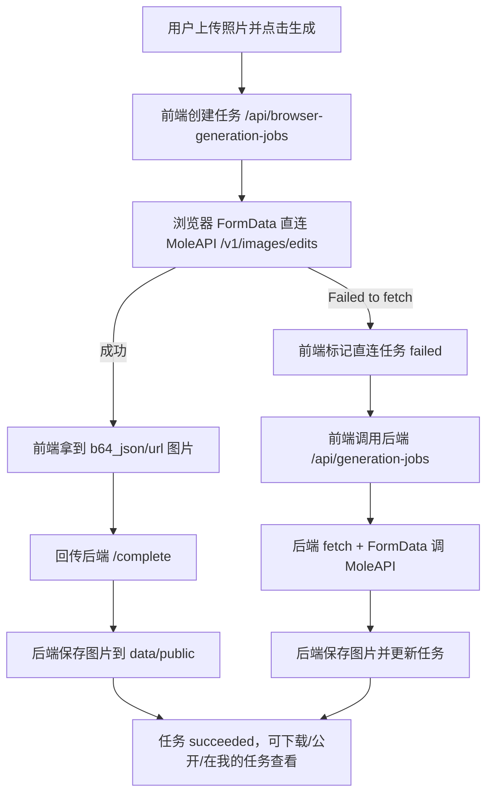

# Wedding Photo

AI 婚纱照生成网站。用户上传一张原始人像照片，网站使用 `tools.config.json` 中的内置婚纱照提示词，并组合用户的可选补充需求，调用 MoleAPI/OpenAI 兼容图片接口生成新的婚纱照。

当前项目采用“浏览器直连优先，后端兜底托管，后端统一保存任务和作品”的生成链路：

1. 前端先在后端创建一条生成任务。
2. 浏览器使用原生 `FormData` 直连 MoleAPI `/v1/images/edits`。
3. 成功后，前端把生成图片回传后端保存。
4. 如果浏览器直连出现 `Failed to fetch` 等网络错误，前端自动切换到后端生成。
5. 后端兜底生成使用 Node 原生 `fetch + FormData + Blob`，不再使用 curl。

## 本地运行

项目使用 SQLite 保存数据，并通过纯 JS/WASM 版本 `sql.js` 操作数据库。

```bash
npm install
npm start
```

然后打开：

```text
http://localhost:4173
```

如果本机访问 MoleAPI 需要代理，可以这样启动：

```bash
HTTPS_PROXY=http://127.0.0.1:7890 \
HTTP_PROXY=http://127.0.0.1:7890 \
NO_PROXY=localhost,127.0.0.1 \
NODE_OPTIONS=--use-env-proxy \
npm start
```

## 主要文件

- `index.html`：页面骨架、顶部导航、设置弹窗、后台弹窗。
- `styles.css`：全站样式。
- `app.js`：前端单页应用、上传预览、生成链路、任务列表、作品发布。
- `server.js`：HTTP 服务、API 路由、MoleAPI 后端兜底、图片保存、静态资源服务。
- `db.js`：SQLite 初始化和数据读写。
- `schema.sql`：数据库表结构。
- `tools.config.json`：婚纱照工具配置和默认提示词。
- `assets/brand-icon.png`：站点主品牌图标。
- `assets/favicon.png`：浏览器标题栏图标。
- `assets/apple-touch-icon.png`：移动端添加到主屏幕图标。
- `assets/wedding-preview.png`：首页和工具页示例图。
- `data/hairstyle.sqlite`：本地数据库，文件名保留历史兼容。
- `data/public/*.png`：生成后保存的图片。

## 提示词配置

婚纱照场景配置在：

```text
tools.config.json
```

当前默认工具：

- `slug`: `wedding-photo`
- `defaultModel`: `gpt-image-2`
- `requiresImage`: `true`
- `promptTemplate`: 支持 `{{userPrompt}}`
- `exampleImage`: 示例图路径
- `sampleImages`: 示例图列表

启动服务时，`db.js` 会读取 `tools.config.json` 并同步到 `tool_configs` 表。需要更新默认提示词时，优先修改 JSON 文件里的 `promptTemplate`，不要硬编码到 `app.js` 或 `server.js`。

前端会通过：

```text
GET /api/tools/wedding-photo
```

获取工具配置，然后在 `buildPrompt(tool, userPrompt)` 中把用户补充内容注入 `{{userPrompt}}`。

## MoleAPI 设置

页面右上角“设置”里填写：

- API Key：用户自己的 MoleAPI Key
- Base URL：例如 `https://jp.moleapi.com/v1`
- 图片模型：`gpt-image-2`

API Key 默认只保存在浏览器 `localStorage` 的 `hs.settings` 中。后端不会保存明文 API Key，只保存指纹：

```text
sha256(apiKey + SERVER_SECRET)
```

## 生成链路

### 入口

前端生成入口在 `app.js`：

```text
generateImage()
createGenerationJob(tool, prompt)
```

点击“生成婚纱照”后，前端会检查：

- 是否填写 API Key
- 是否上传图片
- 当前工具是否需要图片

### 浏览器直连优先

前端先调用：

```text
POST /api/browser-generation-jobs
```

创建一条 `processing` 任务。然后浏览器直接请求：

```text
POST {baseUrl}/images/edits
Authorization: Bearer <MoleAPI Key>
Content-Type: multipart/form-data
```

表单字段与 BYOK 类似：

- `model`
- `prompt`
- `size`: `1024x1024`
- `output_format`: `png`
- `quality`: `auto`
- `moderation`: `auto`
- `image[]`: 用户上传的原图文件

成功后，前端调用：

```text
POST /api/browser-generation-jobs/:jobId/complete
```

把图片 data URL/base64 回传后端。后端保存到：

```text
data/public/{jobId}.png
```

并把任务更新为 `succeeded`。

### 后端兜底

如果浏览器直连出现 `Failed to fetch`、`NetworkError`、`Load failed` 等网络层错误，前端会先调用：

```text
POST /api/browser-generation-jobs/:jobId/fail
```

把直连任务标记为失败，然后自动切换到：

```text
POST /api/generation-jobs
```

后端会使用 Node 原生 `fetch + FormData + Blob` 请求 MoleAPI 图片编辑接口。成功后同样保存图片，并把任务更新为 `succeeded`。

### 链路图



## 后端接口

### 健康检查

```text
GET /api/health
```

### 工具配置

```text
GET /api/tools
GET /api/tools/:slug
```

### 测试 Key

```text
POST /api/settings/test-key
```

当前只做格式存在性检查，不会真正请求 MoleAPI。

### 浏览器直连任务

创建任务：

```text
POST /api/browser-generation-jobs
```

请求体：

```json
{
  "apiKey": "用户当前 MoleAPI Key",
  "prompt": "最终提示词",
  "tool": "wedding-photo"
}
```

完成任务：

```text
POST /api/browser-generation-jobs/:jobId/complete
```

请求体：

```json
{
  "apiKey": "用户当前 MoleAPI Key",
  "image": "data:image/png;base64,...",
  "revisedPrompt": "可选"
}
```

失败任务：

```text
POST /api/browser-generation-jobs/:jobId/fail
```

请求体：

```json
{
  "apiKey": "用户当前 MoleAPI Key",
  "error": "错误信息"
}
```

### 后端兜底生成

```text
POST /api/generation-jobs
```

请求类型：`multipart/form-data`

字段：

- `apiKey`
- `baseUrl`
- `model`
- `prompt`
- `tool`
- `requiresImage`
- `image`

### 查询生成任务

```text
GET /api/generation-jobs/:jobId
```

### 我的历史任务

```text
POST /api/my/generations
```

请求体：

```json
{
  "apiKey": "用户当前 MoleAPI Key"
}
```

后端会用 API Key 指纹查询 `generations` 表，不保存或返回完整 API Key。

### 作品

公开作品：

```text
POST /api/works
```

作品列表：

```text
GET /api/works
```

作品详情：

```text
GET /api/works/:workId
```

取消公开：

```text
DELETE /api/works/:workId
```

请求体：

```json
{
  "manageToken": "..."
}
```

## 前端路由

前端是 hash 路由：

- `#/`：首页
- `#/apps/wedding-photo`：婚纱照生成页
- `#/works`：公开作品
- `#/works/:id`：作品详情
- `#/my-generations`：我的任务
- `#/admin`：后台配置

主要状态集中在 `app.js` 顶部的 `state` 对象里，包括语言、设置、工具列表、当前上传图片、当前结果、我的任务等。

## 数据库

后端会自动创建：

```text
data/
data/public/
data/hairstyle.sqlite
```

主要表：

- `tool_configs`：工具配置。
- `generations`：生成任务。
- `works`：公开作品。

`generations` 记录每次生成任务的状态：

- `queued`
- `processing`
- `succeeded`
- `failed`

“我的任务”按当前 API Key 指纹查询 `generations` 表。

## 安全说明

当前后端不会保存完整 MoleAPI Key。

生成任务只保存：

```text
apiKeyFingerprint = sha256(apiKey + SERVER_SECRET)
```

作品公开后，后端返回 `manageToken`，用于后续取消公开。后端只保存它的 hash，不保存明文。

生产环境请设置：

```bash
SERVER_SECRET="换成一个强随机字符串"
ADMIN_PASSWORD="换成更安全的后台密码"
```

## 当前限制

- 浏览器直连阶段如果用户关闭页面或刷新页面，会中断直连请求。
- 后端兜底可以继续托管生成，但只有在前端捕获到直连网络错误后才会触发。
- 本地数据库文件名仍为 `hairstyle.sqlite`，这是为了兼容历史数据。
- 公开作品只保存本地文件路径，没有云存储和 CDN。
- 暂未加入账号、支付、额度、内容审核和对象存储。
